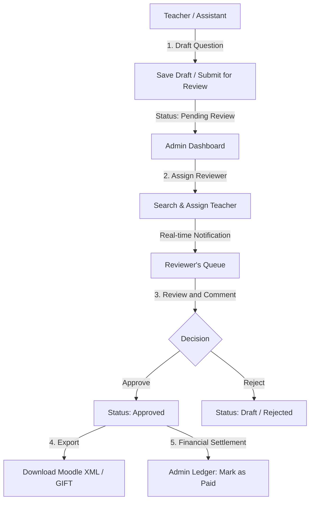

# 🚀 Moodle Question Bank — Complete Operational & Technical Manual

Welcome to the definitive guide for setting up, running, operating, and managing the **Moodle Question Bank** system. This application is an advanced platform built using Angular, TailwindCSS, PrimeNG, and Supabase. It enables teachers to author, import, peer-review, and export quiz questions in various formats (Moodle XML, GIFT, Aiken, DOCX), while enabling administrators to manage review tasks, monitor teacher performance, and settle payments.

---

## 🗺️ 1. System Architecture & Workflows

Below is the conceptual flow showing how questions originate from teachers, undergo peer review, get approved, and are ultimately exported or settled for payment.



---

## 🛠️ 2. Technology Stack

* **Frontend Framework**: Angular v21.2.9 (using Standalone Components, Signal state management, and modern Router Guards)
* **UI & Component Library**: PrimeNG v21.1.6 & PrimeIcons (highly customized premium theme)
* **Styling**: TailwindCSS v3.4.17 & Custom SCSS/CSS variables for deep responsive styling
* **Backend Database & Real-time**: Supabase (PostgreSQL with Row Level Security, Auth Services, and Real-time Table Subscriptions)
* **Document Parsing**: Mammoth.js (extracts plain text from `.docx` files to support direct Word imports)

---

## 💾 3. Database Schema Reference

The database resides in Supabase. The system operates on the following tables:

| Table Name | Primary Key | Description / Columns |
| :--- | :--- | :--- |
| `profiles` | `id` (UUID) | User metadata: `email`, `full_name`, `avatar_scale`, `avatar_pos_x`, `avatar_pos_y`, `updated_at`. |
| `user_roles` | `user_id` (UUID) | Access levels: `role` (`admin`, `teacher`, `assistant_teacher`). |
| `question_categories` | `id` (UUID) | Hierarchical categorization: `name`, `description`, `parent_id` (self-referencing), `created_by`, `sort_order`, `is_global`. |
| `questions` | `id` (UUID) | Core questions: `name`, `question_text`, `general_feedback`, `qtype`, `version`, `status` (`draft`, `pending_review`, `pending_teacher_review`, `approved`), `created_by`, `category_id`, `penalty`, `default_grade`, `deleted_at`, `metadata` (JSON: tags, comments, paid status). |
| `answers` | `id` (UUID) | Answer choices: `question_id` (FK to questions), `answer_text`, `fraction` (0-100 grade percentage), `feedback`. |
| `assignments` | `id` (UUID) | Peer-review tasks: `question_id` (FK), `assigned_to_id`, `assigned_to_name`, `assigned_by_id`, `assigned_by_name`, `status`, `assigned_at`, `version`. |
| `notifications` | `id` (UUID) | Real-time push alerts: `user_id` (FK), `type`, `title`, `message`, `metadata` (JSON), `is_read` (Boolean). |

---

## ⚙️ 4. Quick Start & Setup Guide

### Prerequisites
* **Node.js**: v18.x, v20.x, or v22.x
* **NPM**: v10.x or above (configured with `npm install`)

### Local Server Installation
To get the frontend dev environment running:
```bash
# 1. Install dependencies
npm install

# 2. Run the development server
npm run start
```
The server will boot up at `http://localhost:4200/`.

---

## 🗄️ 5. Database Initialization & Seeding

The project features a standalone database reset and seed script located in the `scratch/` folder. This is excellent for testing workflows with pre-populated questions, assignments, and historical comments.

To clean and reseed your Supabase database:
```bash
node scratch/reset_and_seed_db.js
```

### 🔑 Test User Credentials
The database seeding scripts initialize the following accounts:

| User Role | Email | Password | Purpose / Scenarios |
| :--- | :--- | :--- | :--- |
| **System Administrator** | `admin@mail.com` | `admin123` | Assign review tasks, track team performance, settle ledger payments. |
| **Senior Teacher** | `teacher@mail.com` | `teacher123` | Author questions, perform peer reviews, approve/reject assigned tasks. |
| **Assistant Teacher** | `teacher2@mail.com` | `teacher123` | Create draft questions, request senior teacher review, update profile. |
| **Regular Teacher** | `user1@mail.com` | `user123` | Secondary reviewer account to test multi-reviewer features. |

---

## 📥 6. Import and Export Mechanics

The `ImportExportService` implements powerful text parsing and file format translations.

### 📤 Export Formats
1. **Moodle XML**: 
   * Fully conforms to the standard Moodle schema.
   * Auto-packages categories into hierarchical XML blocks (e.g., `$course$/top/Software Engineering`).
   * Supports tags, feedback, penalties, and shuffle options.
2. **GIFT Format**:
   * Generates standard text-based quiz formats for easy text editing and importing.
   * Supports Multiple Choice, True/False, Short Answer, and Essay.

### 📥 Import Formats
You can import questions by either pasting text directly or uploading a file (including Word documents):

* **Word Documents (`.docx`)**: The system parses the document, extracts raw text using `Mammoth.js`, and automatically runs detection algorithms to see if the structure matches **Structured Export**, **Aiken**, or **GIFT** syntax.
* **Aiken Format**: Simple multiple-choice representation:
  ```text
  What is the capital of Cambodia?
  A. Siem Reap
  B. Phnom Penh
  C. Battambang
  ANSWER: B
  ```
* **GIFT Format**: Flexible syntax supporting brackets `{}` for answers.
* **Moodle XML**: Parses full Moodle XML structure back into database models.
* **Structured Export**: A clean custom format designed to exchange rich question metadata (e.g. `Type:`, `Tags:`, options and answers).

---

## 👥 7. Functional Workflows

### 👤 A. Teacher & Assistant Workflows

#### 1. Question Authoring & Form Options
Teachers can author questions by navigating to `teacher/new-question`.
* **Dynamic Form Layout**: Choose between 14 question types:
  * *Standard*: Multiple Choice, True/False, Short Answer, Numerical, Essay, Matching.
  * *Calculated*: Calculated, Calculated Multichoice, Calculated Simple.
  * *Interactive*: Drag and Drop onto Image/Text, Ordering.
  * *Specialized*: CodeRunner, All-or-Nothing Multi-Choice.
* **Smart Fields**: Provide overall grades, penalties, feedback, and interactive answer choice rows.
* **Versions**: Editing an approved question automatically increments its version count and creates a historical parent-child relation.

#### 2. Peer Review Queue & Notifications
* A red bell notification badge dynamically pops up when an admin assigns you to a question.
* Teachers go to their **Assigned Tasks** dashboard tab to view the questions they need to review.
* Teachers can open the detail review pane, write feedback comments, and select **Set as Ready (Approve)** or **Reject**.

#### 3. Custom Profile & Avatars
* Located at `teacher/profile`.
* Teachers can set their display name and use sliders to dynamically scale and position their avatar image.

---

### 👑 B. Administrator Workflows

#### 1. Real-time Review Allocation (Task Assignment)
* Navigate to the **Admin Dashboard** and open the **Pending Review** tab.
* Click **Assign Task** on any unassigned question.
* Start typing a teacher's name. The system performs dynamic autocomplete lookups.
* Assign multiple peer-reviewers to the same question for absolute quality control.

#### 2. Team Performance Dashboard
* Select the **Team Performance** tab.
* Real-time counters list **Total Team Members**, **Approved Questions**, and **Unreviewed Questions**.
* A tabular ledger details exactly how many questions each teacher authored (Approved vs. Drafts), how many reviews they completed, and their current workload.

#### 3. Interactive Payment Ledger
* Click on a teacher's row in the performance table to expand their drill-down view.
* View dynamic metrics cards and specific lists of their authored/reviewed questions.
* Under the **Authored Questions** list, admins can click the **Mark as Paid** button. This stamps the question's metadata JSON with payment confirmation parameters (`paid_at` timestamp, `paid_by` admin email), ensuring exact accounting and historical ledger preservation.

---

> [!TIP]
> **Performance Recommendation**:
> When importing very large lists of questions from Word or XML (100+ questions), let the upload complete. The UI utilizes background worker queues to process questions and save them chunk-by-chunk to Supabase without freezing the user interface.

> [!IMPORTANT]
> **Data Integrity Guard**:
> All review updates, status adjustments, and payment markings trigger transactional updates to prevent data desynchronization. If an admin deletes a teacher profile, their past authored work remains fully preserved and attributed in the historical database ledger via custom schema handling.
