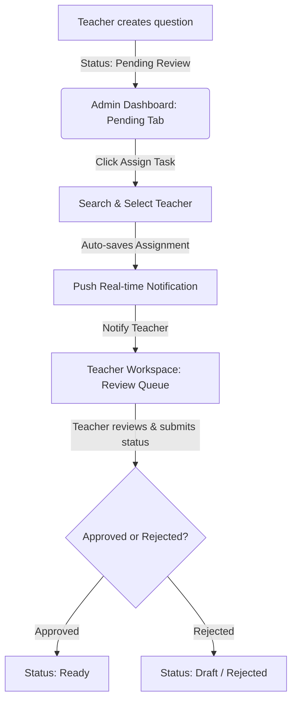

# 📋 Task Assignment & Teacher Performance System Manual

Welcome to the official operational guide for the **Task Assignment** and **Teacher Performance Tracking** systems inside the Moodle Question Bank.

This document details how to delegate question reviews, how teachers receive and complete review tasks, and how their overall performance is tracked for payments.

---

## 📋 1. The Task Assignment System

The **Task Assignment** system enables System Administrators to delegate quality assurance and review duties to registered teachers. This promotes peer-review and ensures all questions are validated before being marked as **Ready** for Moodle integration.



### How to Assign a Task (Admin Workflow)
1. Navigate to the **Admin Dashboard** and select the **Pending Review** tab.
2. For any question that does not have a reviewer assigned, you will see a prominent **Assign Task** button.
3. Clicking **Assign Task** opens an autocomplete search box.
4. Type the name or email of any registered teacher. The search retrieves matches dynamically from the database.
5. Select one or more teachers. Multiple peer-reviewers can be assigned to a single question for rigorous validation.
6. Once selected, the system:
   - Stores the assignment record in the `assignments` table.
   - Updates the question's `metadata.assigned_reviewers` field to cache reviewer names and prevent desynchronization.
   - Automatically sends a real-time notification to the selected teacher(s).

### How Teachers Review Tasks
1. When a teacher logs in, they will see a **Bell Icon** on their header with a red indicator if they have new review assignments.
2. Clicking the notification or navigating to the **Assigned Tasks** tab reveals their queue.
3. The teacher can click **Review Details** to view the question's text, options, answers, and comments.
4. Teachers can leave feedback in the comment feed and click either:
   - **Set as Ready (Approve)**: Moves the question to the **Approved** state, enabling it for Moodle export.
   - **Reject**: Marks the question as rejected and returns it to the author's draft queue with feedback.

---

## 📈 2. Teacher Performance Tracking

The **Teacher Performance** system enables administrators to track the productivity, quality of contributions, and peer-review engagement of every teacher. This data serves as the direct source of truth for **payment settlement**.

### Performance Metrics Tracked
| Metric | Description | Purpose |
| :--- | :--- | :--- |
| **Questions Authored (Ready)** | Unique questions authored by the teacher that have been successfully approved. | Primary payment trigger for content creation. |
| **Questions Authored (Draft/Review)** | Questions authored by the teacher that are currently in draft or undergoing peer review. | Tracks active writing pipeline. |
| **Reviews Completed** | Peer-review assignments successfully resolved (approved/rejected) by this teacher. | Primary payment trigger for quality assurance work. |
| **Current Workload (Tasks Assigned)** | Pending reviews assigned to this teacher that have not yet been completed. | Tracks current reviewer burden to avoid overloading. |
| **Payment Settlement Status** | Calculates total settled payments versus pending payouts based on ready work. | Financial ledger interface. |

### Accessing the Team Dashboard
1. Select the **Team Performance** tab in the main Admin sidebar.
2. At a glance, you will see the **Total Team Members**, **Total Approved Questions**, and **Questions Pending Review** across the entire team.
3. The main tracking table displays each teacher's name, email, active status, authored question breakdown, completed reviews, pending workload, and a summary of their payment-eligible actions.

---

## 🔍 3. Drill-Down: Detailed Performance & Settlement Report
Clicking the **Details Arrow** (or anywhere on a teacher's row) opens the **Detailed Teacher Performance & Settlement Report**. 

```
[ Team Performance ] ──(Click Teacher Row)──> [ Teacher Performance & Settlement Report ]
                                              ├── Authored Questions Tab (Filtered)
                                              ├── Assigned Review Tasks Tab (Filtered)
                                              └── Interactive Payment Ledger ("Mark as Paid")
```

#### Inside the Report:
* **Dynamic Information Cards**: Quick widgets displaying the selected teacher's total authored ready items and completed reviews.
* **Interactive Lists**: Browse the exact questions authored by or assigned to this teacher.
* **Ledger Settlement**: Administrators can click **Mark as Paid** on any unpaid, approved question. This stamps the question's metadata with the payment date and the administrator's name, archiving it from outstanding payables while preserving the historic ledger.

---

> [!NOTE]
> **Data Integrity Guard**: 
> All teacher names are loaded dynamically by reconciling three layers of data: explicit database roles, user profiles, and historic question metadata. This ensures that even if a teacher's profile is updated or removed, their past contributions remain linked to their name, preventing broken profiles in your reports.

> [!IMPORTANT]
> **Real-time Synchronization**: 
> Performance metrics automatically update whenever a status changes (e.g., when a teacher approves a question, their *Reviews Completed* immediately increments, the author's *Questions Authored (Ready)* increments, and the pending workload decrements in real-time).
